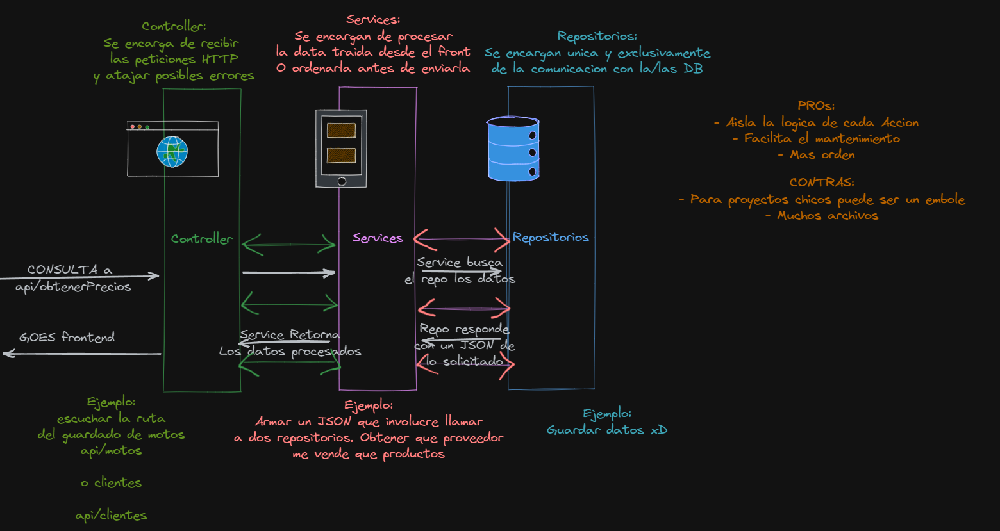

# motos-rest
Una simple API REST para explicar el funcionamiento de una arquitectura Controlador Servicio Repositorio

### Controlador
se encarga de atender las peticiones HTTP y dirigir a los servicios que corresponda
### Servicio
se encarga de procesar la logica (si fuese necesario) para lo que se haya solicitado
### Repositorios
Se encargan de comunicarse con la DB y guardar/consultar/modificar lo que les fue pedido
    